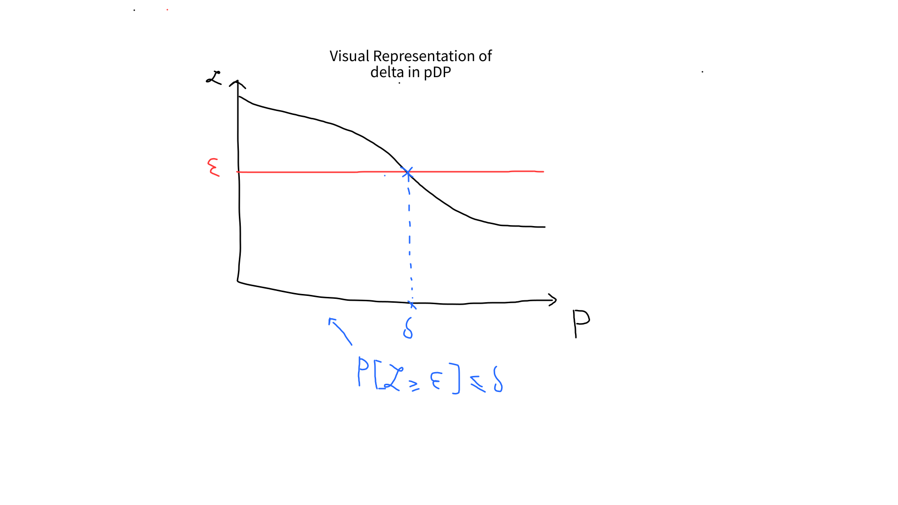
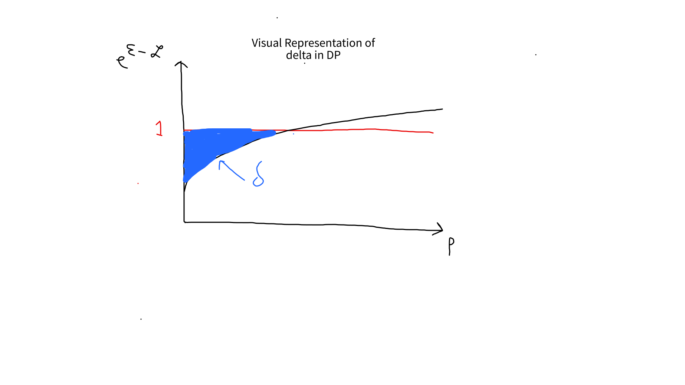

# Differential Privacy from A to $\epsilon$ with applications to Deep Learning

## Disclaimer
This blog post **does not aim** to be a comprehensive guide on Differential-Privacy, and **I don't consider myself a DP expert in any way**. Why am I writing this then? Well, it's purely an egoistic act :) $\to$
this is merely a polished collection of notes on DP I have collected after reading papers, blogs and lecture notes from people who can actually call themselves expert on the matter. The benefit one may take for this blogpost is, perhaps, that it will be more easy to digest all the notions I have spent time reading about and pondering on.

## Differential Privacy: Background
If you are a security or privacy professional, or a data scientist/engineer perhaps, you might have already heard of Differential Privacy (DP for friends).
In a few words, DP is a security property of a mechanism acting on some input database (e.g., a query on the database, the training of a machine learning model). If the property is satisfied by the mechanism, we know that, when the mechanism takes as input two database which are *almost* equal, the output will be *almost* the same. More formally:
>  A mechanism $\mathcal{M}$ is $\epsilon$-DP if for any neighbouring (i.e., differing in one element) datasets $D_1,D_2$, for any $S \in \mathcal{O}$:
$$
\mathbb{P}[\mathcal{M}(D_1) \in S] \leq e^\epsilon \cdot \mathbb{P}[\mathcal{M}(D_2) \in S] 
$$
What this definition tells us, is that the probability that the output of our mechanism was generated from a database $D_1$ is *essentially* the same to the one it was generated from a similar database $D_2$. One of the cool things about DP? We can quantifiy what *essentially* means in mathematically terms.

To see this, let's first define a quantity called *Privacy Loss Random Variable (PLRV)*:
$$
\mathcal{L}_{D_1/D_2}(O) = \ln \frac{\mathbb{P}[\mathcal{M}(D_1)=O]}{\mathbb{P}[\mathcal{M}(D_2)=O]} 
$$
Essentially, PLRV tells us how much privacy we are losing by releasing the output $O$ of the mechanism: if its value is really big (in absolute value), then an adversarial observer could easily tell $D_1$ and $D_2$ apart. DP guarantees us that, **no matter what**:
$$
\mathbb{P}_{O-\mathcal{M}(D_1)}[\mathcal{L}_{D_1/D_2}(0) \geq \epsilon] = 0
$$
that is, the PLRV is always bounded by $\epsilon$, which in DP jargon is called *privacy budget*. We call this property *$\epsilon$-indistinguishability*. Hence, by taking $\epsilon$ adequatelly small, we can protect the privacy of our data. By the way, have you noticed that we can think about DP as a looser version of the cryptographic notion of *semantic security* (IND-CPA)?

To close this section, here are some nice guarantees given by DP:
1. DP protects data **no matter what**: no matter how powerful (computationally speaking) is your adversary, how knowledgable is your adversary (assume it knows all the database but a target entry you wish to protect), who you are trying to protect (which data entry), or what you are trying to protect (a sensitive attribute perhaps?); DP will have your back and its guarantee will still hold.
2. You can **quantify the privacy loss**: pretty handy, no?
3. **Composition** of DP-mechanisms: DP has this very nice property that you can compose various mechanisms providing DP, and the resulting composed mechanism will still be DP (even if with looser guarantees).
4. **Immunity to post-processing**: if you put the output of a DP mechanism through a fixed process, its output will still be DP.

## On the subtlelties of $\delta$ in $(\epsilon,\delta)$-DP
Another definition of DP you might have encountered (which is actually the complete and most general definition of $\epsilon$-DP), is the following:

>  A mechanism $\mathcal{M}$ is $(\epsilon,\delta)$-DP if for any neighbouring (i.e., differing in one element) datasets $D_1,D_2$, for any $S \in \mathcal{O}$:
$$
\mathbb{P}[\mathcal{M}(D_1) \in S] \leq e^\epsilon \cdot \mathbb{P}[\mathcal{M}(D_2) \in S] + \delta 
$$

We have an additional term now, $\delta$. What this term represents, in very simple words, is the probability of *things going wrong*. Naturally, it is better to have this term as little as possible (like *very little*, i.e., *cryptographically small*: $\delta \ll \frac{1}{\|D_1\|}$)
Now, it turns out that the actual meaning of *things going wrong* it's quite deep, and rather (mathematically) elegant. Infact, in literature, we distinguish between two characterization of $\delta$.

The first one is the following:
> With probability $1-\delta$, we are guaranteed to have $\epsilon$-indistinguishability, i.e., a mechanism $\mathcal{M}$ is $(\epsilon,\delta)$-probabilistically-DP (or pDP) if for any neighbouring (i.e., differing in one element) datasets $D_1,D_2$:

$$
\mathbb{P}_{O\sim\mathcal{M}(D_1)}[\mathcal{L}_{D_1/D_2}(O) \geq \epsilon] \leq \delta
$$

We have hence defined *($\epsilon,\delta$)-probabilistic-DP* (pDP in short). What $\delta$ represents in pDP, is the probability of PLRV being bounded by our $\epsilon$. This is also equivalent to saying that the probability of our output $\mathcal{M}(D_1)=O$ being in a set $S^*$ such that it can be distinguished from $\mathcal{M}(D_2)$ is at most $\delta$:
> (Alternate definition of pDP): a mechanism $\mathcal{M}$ is $(\epsilon,\delta)$-probabilistically-DP (or pDP) if for any neighbouring (i.e., differing in one element) datasets $D_1,D_2$, there exists a set $S^* \in \mathcal{O}$ such that $\mathbb{P}[\mathcal{M}(D_1)=O \in S^*] \leq \delta$, and it holds that:
$$
\mathbb{P}[\mathcal{M}(D_1) \in S \setminus S^*] \leq e^\epsilon \cdot \mathbb{P}[\mathcal{M}(D_2) \in S \setminus S^*]
$$
An example of a mechanism $\mathcal{M}$ which is ($\epsilon,\delta$)-pDP is the so called "*name-and-shame*" mechanism. Suppose that this mechanism takes a database $D_1$ as input containing a sensitive date entry $x_i$ (i.e., imagine an adversary trying to distinguish between $D_1$ and $D_2$ = $D_1 \setminus x_i$). The mechanism scans the database and, with probability $\delta$, outputs $x_i$, and with probability $1-\delta$ does not output anything. It is straightforward to see that the mechanism satisfies ($\epsilon,\delta$)-pDP. In particular, with probability 
$1-\delta$, we have that the PLRV is exaclty $0$ (indeed, $\epsilon = 0$ as this mechanism provides *almost always* complete privacy by outputting data items which are both in $D_1$ and $D_2$). With probability $\delta$, this mechanism outputs $x_i$, which allows the adversary to distinguish the output generated by $D_1$ and $D_2$. You can also verify that the mechanism satisfies also the second definition of pDP (the one with $S^*$).

Now, the charachterization of $\delta$ following pDP is very easy to grasp, but it misses a very important subtlelty. Indeed, we can have other mechanisms (like adding noise drawn from a Gaussian distribution to our output), where the privacy loss is not immedeatly disastrous (i.e., $\mathcal{L}_{D_1/D_2}(O) \to \infty$) as we go past $\epsilon$ (like in *name-and-shame*).
For this, we have a second charachterization of $\delta$:

>  A mechanism $\mathcal{M}$ is *$(\epsilon,\delta)$-approximately-DP* (aDP for short)if for any neighbouring (i.e., differing in one element) datasets $D_1,D_2$, for any $S \in \mathcal{O}$:
$$
\mathbb{P}[\mathcal{M}(D_1) \in S] \leq e^\epsilon \cdot \mathbb{P}[\mathcal{M}(D_2) \in S] + \delta 
$$

You have probably noticed that this is exactly the first definition of ($\epsilon,\delta$)-DP we have given. In this formulation, however, the meaning of $\delta$ is more subtle, as it actually represents (loosely speaking) the probability mass of the events for which we leak more than $\epsilon$, *weighted* by how probable they are. Mathematically, one can show that, in ADP:
$$
\delta = \mathbb{E}_{O \sim \mathcal{M}(D_1)}[max(0,1-e^{\epsilon-\mathcal{L}_{D_1/D_2}(O)})]
$$

Then, what is $\delta$ all about? In a few words:
- pDP: it indeed represents the probability that the $\epsilon$-indistinguishability property is **NOT** satisfied (equivalently is the probability that our mechanism outputs something called a *distinguishing event* that allows an adversarial observer to tell $D_1$ and $D_2$ apart).
- aDP: it instead represents the *probability mass* of all the events for which $\epsilon$-DP is not satisfied. aDP grasps that events for which we leak privacy might not be all *disastrous*: some leak more information than others, and they are weighted by their probabilities.

Here is a graphical representations of the two charachterizations of $\delta$:

Finally, note that:
- ($\epsilon,\delta$)-pDP $\to$ ($\epsilon,\delta$)-aDP (pDP implies aDP).
- In general, ($\epsilon,\delta$)-aDP $\not\to$ ($\epsilon,\delta$)-pDP (it holds when $\epsilon = 0$, but usually to "go" from pDP to aDP we have to loosen the parameters. Concretely, probability that PLRV is bound by $\epsilon$ does not necessarily hold for a ($\epsilon,\delta$)-aDP mechanism).

## On the shortcomings of ($\epsilon,\delta$)-DP
In the previous section we have seen that ($\epsilon,\delta$)-DP has a fundamental limitation, that is it is very hard to grasp with this notion what happens with probability $\delta$: does privacy degrade gracefully like when using the Gaussian noise mechanism, or is is destroyed completely as in *name-and-shame*? In short, with probability $\delta$, *all bets are off* as a loss of infinity can happen. Finally, it turns out that the bound you get when composing ($\epsilon,\delta$)-DP sequentially are not *tight* (i.e., we can find better bounds).

That is why in literature several relaxations of DP have been proposed.
Historically, the first relaxation presented by C.Dwork et al. was *Concentrated-DP*:
> A mechanism $\mathcal{M}$ is ($\mu,\tau$)-concentrated-DP (cDP), if PLRV has mean $\mu$ and if subtracting the mean from it, we obtain a sub-gaussian RV with standard deviation $\tau$:
$$
\mathbb{E}_{O \sim \mathcal{M}(D_1)}[\mathcal{L}_{D_1/D_2}(O)] \leq \mu \;\text{and}\; \mathbb{E}_{O \sim \mathcal{M}(D_1)}[e^{(\alpha-1)(\mathcal{L}_{D_1/D_2}(O)]-\mu)}] \leq e^{(\alpha-1)^2 \frac{\tau^2}{2}}
$$
Intuitively, the cDP requires that PLRV to have a small mean, and to be "concentrated" around this mean (hence the name).
This definition offers tighter bounds on composition, however it looses the closeness under post-processing capabilities. This is why Bun et al. proposed a relaxation of cDP named *zero-concentrated-DP* (zcDP):
> 

## References
- [Figure 1 of this paper gives a nice visual representation of the intuition behind aDP](https://eprint.iacr.org/2018/277.pdf).
- A nice comparison between what $\delta$ means is given in this [pretty awesome blogpost](https://desfontain.es/privacy/privacy-loss-random-variable.html), where the author first starts introducing $\delta_1$ as we have seen it in pDP and then it gives a the characterization for aDP. I also took inspiration from this for the graphical representations.
- [Nice comparison between aDP and pDP](https://tigerweb.towson.edu/vguingona/PrivacyPaper.pdf).
- [Another nice blogpost on $\delta$](https://differentialprivacy.org/flavoursofdelta/).
- [SoK about DP](https://arxiv.org/pdf/1906.01337.pdf).
- [The DP cookbook by C.Dwork, the original author of DP](https://www.cis.upenn.edu/~aaroth/Papers/privacybook.pdf).
- [Nice lecture notes on DP](http://www.gautamkamath.com/CS860notes/lec5.pdf).
- [Very technical comparison between pDP and aDP, with also a counter examples that aDP does not imply pDP](https://eprint.iacr.org/2018/277.pdf).

