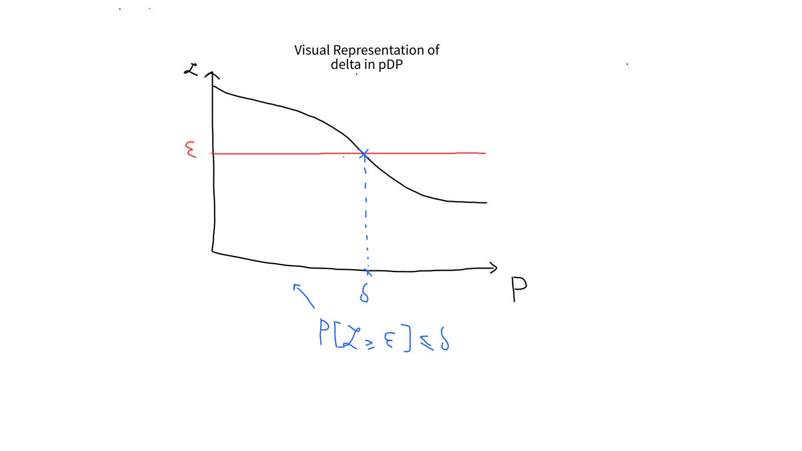
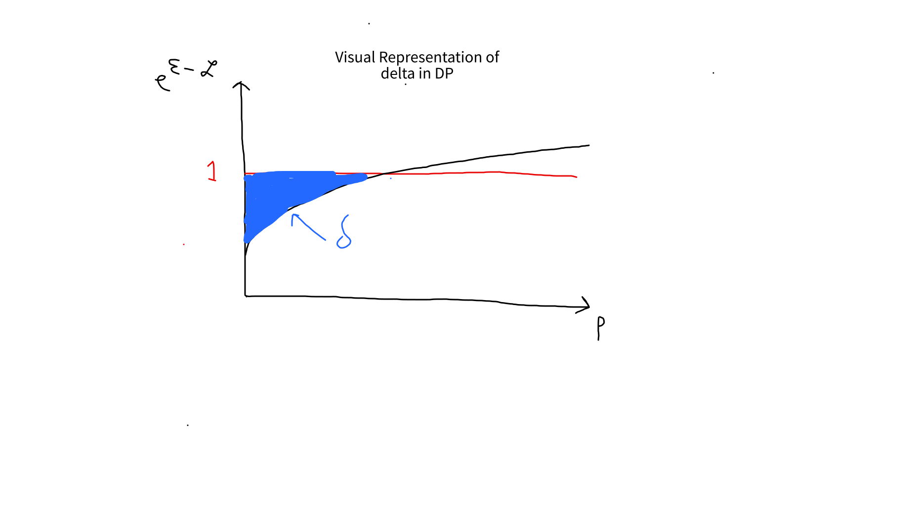

# Differential Privacy from A to $\epsilon$

## Differential Privacy: A quick background
If you are a security or privacy professional, or a data scientist/engineer perhaps, you might have already heard of Differential Privacy (DP for friends).

In a few words, DP is a security property of a mechanism acting on some input database (e.g., a query on the database, or even the training process of a machine learning model). If the property is satisfied by the mechanism, we know that, when the mechanism takes as input two database which are *almost* equal, the output will be *almost* the same. More formally:
>  A mechanism $\mathcal{M}$ is $\epsilon$-DP if for any neighbouring datasets $D_1,D_2$, for any $S \in \mathcal{O}$:
$$
\mathbb{P}[\mathcal{M}(D_1) \in S] \leq e^\epsilon \cdot \mathbb{P}[\mathcal{M}(D_2) \in S] 
$$
What this definition tells us, is that the probability that the output of our mechanism was generated from a database $D_1$ is *essentially* the same to the one it was generated from a similar database $D_2$. One of the cool things about DP? We can quantifiy what *essentially* means in mathematically terms.

To see this, let's first define a quantity called *Privacy Loss Random Variable (PLRV)*:
$$
\mathcal{L}_{D_1/D_2}(O) = \ln \frac{\mathbb{P}[\mathcal{M}(D_1)=O]}{\mathbb{P}[\mathcal{M}(D_2)=O]} 
$$
PLRV tells us how much privacy we are losing by releasing the output $O$ of the mechanism: if its value is really big (in absolute value), then an adversarial observer could easily tell $D_1$ and $D_2$ apart. DP guarantees us that, **no matter what**:
$$
\mathbb{P}_{O-\mathcal{M}(D_1)}[\mathcal{L}_{D_1/D_2}(0) \geq \epsilon] = 0
$$
that is, the PLRV is always bounded by $\epsilon$, which in DP jargon is called *privacy budget*. We call this property *$\epsilon$-indistinguishability*. Hence, by taking $\epsilon$ adequatelly small, we can protect the privacy of our data. By the way, have you noticed that we can think about DP as a looser version of the cryptographic notion of *semantic security* (IND-CPA)?

## Why DP is cool
DP enjoys some very nice properties:
1. DP protects data **no matter what**: no matter how powerful (computationally speaking) is your adversary, how knowledgable is your adversary (assume it knows all the database but a target entry you wish to protect), who you are trying to protect (which data entry), or what you are trying to protect (a sensitive attribute perhaps?). DP will have your back and its guarantee will still hold.
2. You can **quantify the privacy loss**: pretty handy, no?
3. **Composition** of DP-mechanisms: DP has this very nice property that you can compose various mechanisms providing DP, and the resulting composed mechanism will still be DP (even if with looser guarantees). Composition comes in two flavours: *Sequential*, meaning that applying first an $\epsilon_1$-DP mechanism and then an $\epsilon_2$-DP mechanism on the same data, will result in the same as applying an $\epsilon_1+\epsilon_2$-DP mechanism on the data; and *Parallel*, which means that applying the two mechanisms on disjoint subset of data and realising their output will offer the same privacy guarantees as a $max(\epsilon_1,\epsilon_2)$-DP mechanism (more about this in the following section).  
4. **Immunity to post-processing**: if you put the output of a DP mechanism through a fixed, data-independent process, its output will still be DP. This means that an adversary with no access to the data, who is only observing the output of our mechanism, cannot degrade the privacy guarantees of the mechanism.
5. **Group Privacy**: With DP, we can control the amount of information leakage suffered by a group of data samples (e.g., a group of friends or a family participating in our dataset). This is related to how we define the notion of *neighbouring dataset* in the definition of DP I gave earlier.

In the next section, we'll dive deeper into some of them.

### A word or two on DP composition
Composition is perhaps one of the most interesting properties of DP, as it allows us to beautifully apply DP in very complex mechanisms, such as training a deep neural network!

#### Sequential Composition
The *Standard Composition Theorem* tells as the following:
> If $\mathcal{M}_1$ is a $\epsilon_1$-DP mechanism and If $\mathcal{M}_2$ is a $\epsilon_2$-DP mechanism, then $\mathcal{M}_1 \circ \mathcal{M}_2$ is $\epsilon_1 + \epsilon_2$-DP.

That is, if we *compose* (i.e., apply sequentially) two DP mechanisms, the final $\epsilon$ value will increase proportionally to the sum of the $\epsilon$ of the two mechanisms. It follows that composing $k$ $\epsilon$-DP mechanisms will result in a $k\epsilon$-DP mechanism (the bound increases linearly).

#### Parallel Composition
A much better bound is given by the *Parallel Composition Theorem*:
> Given a dataset $D$, and $k$ mechanisms $\mathcal{M}_1,\dots,\mathcal{M}_k$ such that $\mathcal{M}_i$ satisfies $\epsilon_i$-DP, if we split it in $k$ disjoint chunks $d_1,\dots,d_k$ such that $D = d_1 \cup \dots \cup d_k$, and release $\mathcal{M}_i(d_i)$, then the output will satisfy $max(\epsilon_1,\dots,\epsilon_k)$-DP.

In other words, by splitting the dataset in **disjoint** sets and applying a DP mechanism (even different ones) to each set, then the resulting leakage will be proportional to the maximum leakage allowed by the mechanisms. 

### On the subtlelties of $\delta$ in $(\epsilon,\delta)$-DP
Another definition of DP you might have encountered (which is actually the most general and widespread definition of $\epsilon$-DP), is the following:

>  A mechanism $\mathcal{M}$ is $(\epsilon,\delta)$-DP if for any neighbouring datasets $D_1,D_2$, for any $S \in \mathcal{O}$:
$$
\mathbb{P}[\mathcal{M}(D_1) \in S] \leq e^\epsilon \cdot \mathbb{P}[\mathcal{M}(D_2) \in S] + \delta 
$$

We have an additional term now, $\delta$. What this term represents, in very simple words, is the probability of *things going wrong*. Naturally, it is better to have this term as little as possible (like *very little*, i.e., *cryptographically small*: $\delta \ll \frac{1}{\|D_1\|}$)
Now, it turns out that the actual meaning of *things going wrong* it's quite deep, and rather (mathematically) elegant. Infact, in literature, we distinguish between two characterization of $\delta$.

The first one is the following:
> With probability $1-\delta$, we are guaranteed to have $\epsilon$-indistinguishability, i.e., a mechanism $\mathcal{M}$ is $(\epsilon,\delta)$-probabilistically-DP (or pDP) if for any neighbouring (i.e., differing in one element) datasets $D_1,D_2$:

$$
\mathbb{P}_{O\sim\mathcal{M}(D_1)}[\mathcal{L}_{D_1/D_2}(O) > \epsilon] \leq \delta
$$

We have hence defined *($\epsilon,\delta$)-probabilistic-DP* (pDP in short). What $\delta$ represents in pDP, is the probability of PLRV being bounded by our $\epsilon$. This is also equivalent to saying that the probability of our output $\mathcal{M}(D_1)=O$ being in a set $S^*$ such that it can be distinguished from $\mathcal{M}(D_2)$ is at most $\delta$:
> (Alternate definition of pDP): a mechanism $\mathcal{M}$ is $(\epsilon,\delta)$-probabilistically-DP (or pDP) if for any neighbouring (i.e., differing in one element) datasets $D_1,D_2$, there exists a set $S^* \in \mathcal{O}$ such that $\mathbb{P}[\mathcal{M}(D_1)=O \in S^*] \leq \delta$, and it holds that:
$$
\mathbb{P}[\mathcal{M}(D_1) \in S \setminus S^*] \leq e^\epsilon \cdot \mathbb{P}[\mathcal{M}(D_2) \in S \setminus S^*]
$$

A second and more common charachterization of $\delta$:

>  A mechanism $\mathcal{M}$ is *$(\epsilon,\delta)$-approximately-DP* (aDP for short)if for any neighbouring (i.e., differing in one element) datasets $D_1,D_2$, for any $S \in \mathcal{O}$:
$$
\mathbb{P}[\mathcal{M}(D_1) \in S] \leq e^\epsilon \cdot \mathbb{P}[\mathcal{M}(D_2) \in S] + \delta 
$$

You have probably noticed that this is exactly the first definition of ($\epsilon,\delta$)-DP we have given. In this formulation, however, the meaning of $\delta$ is more subtle, as it actually represents (loosely speaking) the probability mass of the events for which we leak more than $\epsilon$, *weighted* by how probable they are. Mathematically, one can show that, in aDP:
$$
\delta = \mathbb{E}_{O \sim \mathcal{M}(D_1)}[max(0,1-e^{\epsilon-\mathcal{L}_{D_1/D_2}(O)})]
$$

Then, what is $\delta$ all about? In a few words:
- pDP: it indeed represents the probability that the $\epsilon$-indistinguishability property is **NOT** satisfied (equivalently is the probability that our mechanism outputs something called a *distinguishing event* that allows an adversarial observer to tell $D_1$ and $D_2$ apart).
- aDP: it instead represents the *probability mass* of all the events for which $\epsilon$-DP is not satisfied. aDP grasps that events for which we leak privacy might not be all *disastrous*: some leak more information than others, and they are weighted by their probabilities.

Here is a graphical representations of the two charachterizations of $\delta$ (sorry for my nasty handwriting D: ):

Finally, note that:
- ($\epsilon,\delta$)-pDP $\to$ ($\epsilon,\delta$)-aDP (pDP implies aDP).
- In general, ($\epsilon,\delta$)-aDP $\not\to$ ($\epsilon,\delta$)-pDP (it holds when $\epsilon = 0$, but usually to "go" from pDP to aDP we have to loosen the parameters. Concretely, probability that PLRV is bound by $\epsilon$ does not necessarily hold for a ($\epsilon,\delta$)-aDP mechanism). aDP, on the other hand, offers tighter bounds on $\delta$.

### The Holy Grail of ($\epsilon,\delta$)-DP: Advanced Composition
With the definition of ($\epsilon,\delta$)-DP, we can introduce the *Advanced Composition Theorem*:
> For all $\epsilon$, $\delta$, $\delta'>0$, the sequential composition of $k$  ($\epsilon,\delta$)-DP mechanisms satisfies ($\epsilon^*$, $\delta^*$)-DP with:

$$
\epsilon^* = \epsilon \sqrt{2k\log\frac{1}{\delta}}\; + \; k\epsilon\frac{e^\epsilon-1}{e^\epsilon+1}\\
\delta^* = k\delta + \delta'
$$
We can actually prove that this corresponds to a tighter bound than the *Standard Composition* theorem. In particular, we can prove that $\epsilon^* = \mathcal{O}(\epsilon\sqrt{k})$ when $\epsilon < \frac{1}{\sqrt{k}}$ ([proof](https://foundpriv.github.io/notes/advanced_comp.pdf)). When $k > \log\frac{1}{k}$, this is a much tighter bound than $k\epsilon$ from Standard Composition.

## References
- [Figure 1 of this paper gives a nice visual representation of the intuition behind aDP](https://eprint.iacr.org/2018/277.pdf).
- A nice comparison between what $\delta$ means is given in this [pretty awesome blogpost](https://desfontain.es/privacy/privacy-loss-random-variable.html), where the author first starts introducing $\delta_1$ as we have seen it in pDP and then it gives a the characterization for aDP. I also took inspiration from this for the graphical representations.
- [Nice comparison between aDP and pDP](https://tigerweb.towson.edu/vguingona/PrivacyPaper.pdf).
- [Another super nice blogpost on $\delta$ and its meaning](https://differentialprivacy.org/flavoursofdelta/).
- [SoK about DP](https://arxiv.org/pdf/1906.01337.pdf).
- [The DP cookbook by C.Dwork, the original author of DP](https://www.cis.upenn.edu/~aaroth/Papers/privacybook.pdf).
- [Very technical comparison between pDP and aDP, with also a counter examples that aDP does not imply pDP](https://eprint.iacr.org/2018/277.pdf).

